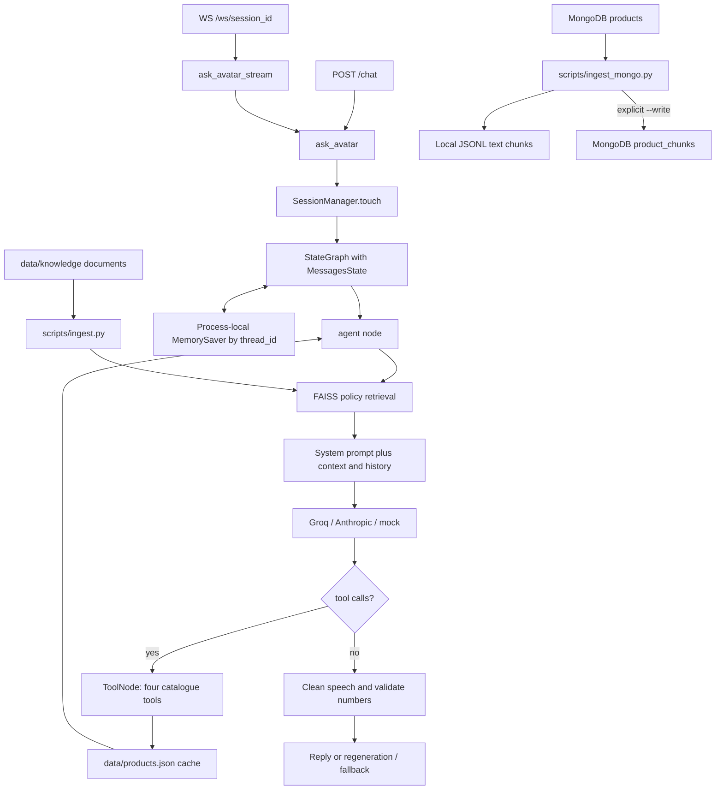

# Greeny architecture audit and prioritized implementation plan

Audit date: 2026-10-08. Baseline: `efa6f43`.
Working branch: `feature/greeny-sales-foundation`.

## Scope and evidence

This phase audits the existing backend and adds one isolated, tested foundation.
It does not implement the entire ten-step roadmap or enable production integrations.
All modules, scripts, catalogue, three knowledge documents, requirements, tests,
MongoDB ingestion instructions, and Ubuntu deployment instructions listed in the
request were inspected locally. Also inspected: tracing, CLI, and live smoke tests.
No database connection, ingestion, paid inference, push, or deployment was performed
during this audit. Existing local MongoDB exports are snapshots, not evidence of
current stock or approval of the configured source.

Installed versions: Python 3.13 environment; LangChain 1.4.3, langchain-core 1.6.6,
LangGraph 1.2.13, Pydantic 2.13.5, FastAPI 0.142.2, PyMongo 4.18.2.
The imported `MemorySaver.delete_thread` and `StateGraph.compile(checkpointer=...)`
APIs exist in this environment. Requirements mostly specify lower bounds, so a
fresh installation is not guaranteed to reproduce it. No package changes made.

## Existing request and data flow

There is **no runtime edge** from MongoDB or the JSONL export to the agent, tools,
or FAISS. FAISS embeds policy files only. MongoDB ingestion creates text chunks
without embeddings or a vector index. `search_knowledge` exists but is not in
`ALL_TOOLS`; automatic retrieval in the agent already supplies policy context.
`GET /products` returns the JSON catalogue directly.

## What exists and what remains incomplete

| Module | Existing implementation | Gaps / verification limits |
| --- | --- | --- |
| `app/brain.py` | Provider factory, tool loop, retrieval, retries, recursion fallback, number validator, mock model | No structured sales state, multilingual classifier, explicit sales routes, or SKU-bound factual verification. Live providers not exercised. |
| `app/tools.py` | Search, details, stock, gift bundles; JSON fallback and cache clearing | No business-service adapter, freshness/status validation, quotation, consent, CRM, or checkout handoff. |
| `app/rag.py` | Markdown/text loading, 400/60 splitting, normalized embeddings, FAISS load/build, distance filtering, source metadata | No approved-document registry, certification evidence, SKU filtering, content expiry, or Mongo chunk integration. |
| `app/server.py` | REST, WebSocket, CORS, automatic FastAPI OpenAPI schema | No structured sales response fields, request limits, authentication/ownership checks, or safe public errors. |
| `app/sessions.py` | MemorySaver, last-active tracking, lazy idle expiry, explicit reset | No persistence, kiosk/channel namespace, retention sweep, concurrency controls, or consent storage. |
| `app/config.py` | Pydantic settings, provider, paths, timeout, CORS | No sales rollout flags, source-verification gate, freshness limits, retention, persistent store settings. Mongo env is handled separately by ingestion. |
| `app/product_chunks.py` | Selected fields, readable text, stable IDs, hashes, SKU/source/status metadata | Includes prices/stock snapshots; does not verify claims or filter inactive products. These must not become live business facts. |
| `scripts/ingest.py` | FAISS build and retrieval inspection | Rebuilds from local documents without content approval/version gate. |
| `scripts/ingest_mongo.py` | Projected read, local export, opt-in upserts, scoped stale-chunk pruning, hash read-back | No schema validation or authority approval. All products read into memory. Writes are not atomic across a run; deleted source products remain. Do not run `--write` without approval. |
| `data/products.json` | Four products and three bundles usable as development fixtures | Static stock/prices and unsupported safety assertions; not a production business service. |
| `data/knowledge/` | Brand, FAQ, shipping/returns text | Contains certification, safety, MOQ, delivery, and contact assertions with no approval records. |
| `tests/` | Four deterministic product chunk tests | No agent, API, session, pricing, consent or multilingual coverage at baseline. Baseline tests: 4 passed. |
| `scripts/live_smoke_test.py` | Eight scripted questions, trace output, success exit code | Uses configured provider and embeddings; can incur network/cost. Some checks accept a product word without verifying exact price. Not a deterministic sales evaluation suite. |
| `MONGO_INGESTION.md` | Accurate separation of export, write and retrieval | Needs authoritative-source, snapshot freshness, and approval guidance before runtime rollout. |
| `DEPLOYMENT_UBUNTU.md` | Launch, systemd, firewall examples | Two workers conflict with process-local memory; no shared store, TLS proxy/auth, readiness/retention guidance. No deployment settings changed. |

## Prioritized findings

### P0: block production sales claims and external actions until addressed

1. **Unverified source and stale inventory.** Tools read an indefinitely cached JSON
   file. Search defaults missing stock to 1 and missing availability to true;
   stock checks may default absent price to zero. No inactive-SKU exclusion or
   inventory observation time exists. Missing data can become a positive claim.
2. **Number matching does not establish factual correctness.** The validator pools
   every number from all historical tool messages and supplied RAG chunks, without
   SKU, field, channel, or freshness association. Prices 1, 2 and 3 are whitelisted.
   A price can be confused with stock or another SKU's value; many linguistic
   number forms, discounts and certifications are not checked.
3. **Knowledge is labelled verified without approval evidence.** FAQ claims certified
   food-contact safety; documents assert broad chemical, microwave, delivery and
   returns guarantees. Prompt and mock responses repeat blanket material claims.
   Repository presence is not proof of an approved policy or SKU certification.
4. **Session access and public errors.** Clients choose raw thread IDs; generated
   HTTP IDs contain only six UUID hex characters. No ownership checks exist for
   chat/reset/WebSocket; `/ws/status` lists session IDs. HTTP errors and WebSocket
   fallback errors expose exception text. CORS is not session authorization.
5. **Consent cannot be enforced yet.** No consent/lead/quote service exists. Although
   no CRM submission currently occurs, future tools must require backend-authorized
   consent and validated qualification, with idempotency and explicit allowed actions.
   Conversation text itself can already contain unsolicited personal information.

### P1: correctness, isolation and recovery

6. **State reset/restart weaknesses.** Expiry occurs only on another message, dormant
   sessions accumulate, and reset suppresses deletion failures while reporting success.
   Restart loses memory; multiple workers have independent checkpoints/timestamps.
7. **Validation and graph memory diverge.** Final response cleanup/regeneration happens
   after graph checkpointing, so rejected assistant text can remain in history.
   Validation receives RAG context only when a trace handler is provided; HTTP does
   not provide one. Trace collection must not control business correctness.
8. **Search can return irrelevant products.** Matching any query word permits generic
   words to match descriptions. Empty/partial IDs can select the first matching name.
   Plastic keyword rejection also rejects requests such as "plastic-free mug".
   Gift fallback hardcodes the lowest price as 949 regardless of catalogue changes.
9. **WebSocket is buffered.** The full response is generated, then split, then collected
   into a list before sending. This is not LLM token streaming. Failure fallback can
   invoke the same message twice. Connections with identical IDs overwrite each other.
10. **Concurrency and resource limits.** No per-session turn serialization, bounded
    history, request length limit, or session creation rate limit. Four-thread WS pool
    is not explicitly shut down. Rate-limit sleep cap does not bound provider/network
    latency or provider SDK retries; regeneration bypasses that retry wrapper.
11. **RAG artifact trust.** FAISS loading opts into pickle deserialization; restrict
    artifacts to trusted builds. Raw retrieved content joins the system prompt with
    no instruction/data separation. Warmup failure still permits a healthy status.

### P2: maintenance and observability

12. Brand identity varies between Greenie, Greeny, Green Fibre and the requested
    websites. No language state or sales playbook exists; sentence count is prompt-only.
    Speech cleanup includes a broad Unicode range; test symbols and Hindi explicitly.
13. Tracing records result previews and WS logs message excerpts, which can contain
    contact data. Callback tool tracking uses the last call and one start time, so
    concurrent tools can be misattributed. No metrics suite or claim provenance API.
14. Dependencies are not locked; direct use of `langchain_text_splitters` relies on
    transitive installation. Runtime model availability and business credentials were
    not verified. Previously shared secrets require operator rotation; not reproduced here.

## Implementation plan and exit criteria

| Phase | Priority and bounded change | Tests / release gate |
| --- | --- | --- |
| 0 (this change) | Audit and standalone Pydantic sales-state contract with safe anonymous defaults and explicit stages; no runtime imports | Validate values, serialization, isolation, atomic updates, backward/forward stages; baseline chunk tests pass. |
| 1 | P0 API hygiene: public error codes, request limits, opaque IDs, ownership and channel namespace; make reset failure explicit | Offline HTTP/WS contract tests, cross-session denial, reset and malformed payload cases. Preserve legacy reply/session_id and WS event shapes. |
| 2 | ProductRepository and BusinessFacts adapters with typed results; keep JSON as explicitly developmental fallback | Mock service tests for inactive SKU, missing/stale stock/price, source mismatch, exact SKU lookup, currency/MOQ/channel. Fail closed when production source verification fails. |
| 3 | Separate personality, sales policies, tool instructions and approved facts; govern RAG sources and SKU claims | English/Hindi/Hinglish tests, no inferred certification, citations and per-turn SKU evidence; remove stale business facts from RAG answers. |
| 4 | Add separate sales state to LangGraph alongside messages; classify intent and route B2B/D2C; ask one missing qualification at a time | Mock LLM fixtures, skipped/backward stages and changed requirements; up to three relevant active recommendations. Feature-gated compatibility tests. |
| 5 | Add safe tools for estimates, draft quotes, consent, lead mocks, human assistance and checkout handoff | Decimal pricing, explicit consent/refusal/revocation, no negotiated discounts, allowed checkout hosts, no payment/order side effects. External submission disabled. |
| 6 | Persistent checkpointer and sales-state repository, namespace, TTL/retention and redacted logs | Restart recovery, expiry, purge, same-session concurrency and multiworker tests using local fixtures. Decide storage before adding packages. |
| 7 | Optional response fields or `/v2/chat`, provenance and OpenAPI examples; HTTP/WS state parity | Snapshot API compatibility, generic errors, health/readiness separation. |
| 8 | At least 30 realistic sales evaluations and complete developer documents | Track intent/stage accuracy, relevance, unsupported facts, consent and qualified leads; deterministic core offline, model-based eval separately opt-in. |
| 9 | Approved staging deployment and integration validation | Explicit approval for database writes, CRM submission, production resources, push/merge/deploy. |

Phase 2 contracts should separate descriptive ProductRepository results from current
BusinessFacts (SKU, source, observation time, status, stock, price, currency, MOQ,
discount eligibility). Verify database identity, collection schema, channel price
semantics and service authorization before selecting MongoDB as authoritative.
An outage must yield unknown availability, not an unnoticed development fallback.

B2B qualification should collect occasion, per-gift budget, quantity, city/date and
customization before a draft; shipping/tax/discount uncertainty must be explicit.
D2C discovery should obtain live business facts before checkout handoff. Neither
flow may submit an order or payment. Lead submission requires recorded consent and
an approved destination, not an LLM-generated authorization flag.

Evaluation matrix: corporate, employee, wedding, anniversary, birthday, festival,
family shopping; price/design/quality/customization/delivery objections; wrong or
inactive SKU; missing price, unknown/stale stock, MOQ; false certification; Hindi,
Hinglish and language switching; consent refusal/revocation; negotiated discount;
human takeover; session isolation/expiry/restart; checkout host restrictions;
multi-requirement turns and changed requirements. Expand each into explicit expected
intent, stage, evidence, next action and prohibited behavior (30+ total).

## Documentation deliverables in subsequent phases

- `GREENY_SALES_ARCHITECTURE.md`: final adapters, state routing and persistence.
- `GREENY_SALES_PLAYBOOK.md`: multilingual flows, objections and approved handoffs.
- `GREENY_API_INTEGRATION.md`: OpenAPI export, payload examples, auth, service contracts.
- `GREENY_DEPLOYMENT_CHECKLIST.md`: Windows/Ubuntu setup, env descriptions, retention,
  approved sources, shared persistence, rollback and operational dependencies.
- `GREENY_TEST_REPORT.md`: current phase evidence, extended with each implementation.

Outstanding business inputs: approved SKU certifications/policies, currency and
channel price interpretation, inventory freshness contract, MOQ/discount service,
CRM API and consent wording, checkout/cart API, human escalation destination,
retention policy and deployment authentication/persistence choices.

## Smallest safe first coding change

Add `app/sales_state.py` with all requested structured fields and eight stage values.
Keep it independent of messages, configuration, DB clients and model providers.
Use immutable snapshots and revalidated updates so failed changes do not mutate
existing state. Permit stage skips/backtracking; stage labels alone confer no
authorization. Generate full-strength anonymous IDs. Store consent status, never
contact details, in this foundation. Backend consent evidence is a later phase.

This additive contract is intentionally not connected to API or LangGraph yet.
It cannot solve the P0 findings by itself; those remain explicit rollout blockers.
Pydantic update implementation follows its
[BaseModel documentation](https://pydantic.dev/docs/validation/latest/api/pydantic/base_model/):
`model_copy(update=...)` does not validate updates, so the helper reconstructs through
`model_validate`. No new dependencies or deployment changes are needed.
