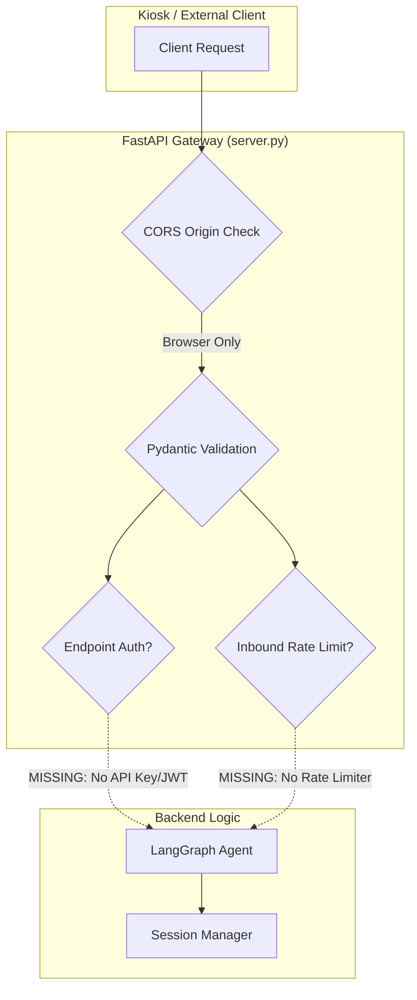

# GREENY BACKEND READINESS & ARCHITECTURAL AUDIT
**Document Version:** 1.0.0  
**Date:** 2026-10-08  
**Author:** Principal Python Backend Engineer & QA Architect  
**Repository:** `https://github.com/greenfibremarketing-spec/kiosk_AIML`  
**Working Branch:** `feature/greeny-reliability-fixes`  
**Base Commit:** `4163bf20cb0e1290106cb79cc793fb9633fa1051`  
**Execution Environment:** Windows Python 3.13.3 | Pytest 9.1.1 | LangGraph 1.2.13 | FastAPI 0.142.2  

---

## EXECUTIVE SUMMARY

This audit delivers an exhaustive, factual verification of the Python AI backend (`kiosk_AIML`) to determine whether it satisfies the Electron/Next.js frontend requirements. 

**Core Verdict:**
1. **Authoritative Website Product API Integration: PASS.** The backend connects cleanly to `https://api.greenfibre.org/api`, accurately parses 17 live products across 4 pages, preserves canonical SKUs (`GF:{id}`), maps `discountedPrice` to selling price and `originalPrice` to MRP, fetches live inventory (700 units verified), and strictly isolates the mock JSON fixture.
2. **Automated Test Suite: PASS.** 130 out of 130 automated tests pass across 9 test suites in 17.13s.
3. **Structured Screen Actions: NOT IMPLEMENTED.** The 6 frontend screen actions (`SHOW_CATEGORIES`, `SHOW_PRICE_BANDS`, `SHOW_PRODUCTS`, `SHOW_PRODUCT`, `COLLECT_PHONE`, `REQUEST_HUMAN`) are not currently emitted by LangGraph or WebSocket handlers.
4. **MongoDB Persistence & Checkpoints: BLOCKED / NOT IMPLEMENTED.** Runtime backend does not connect to MongoDB. `GREENY_AI_MONGO_URL` is unconfigured in `.env`. Sessions and LangGraph checkpoints use in-memory `MemorySaver` and are lost on restart. No consent or conversation records are persisted.
5. **Sales State Machine: PARTIAL.** `app/sales_state.py` defines the Pydantic schema, but it is not yet wired into the LangGraph graph state.
6. **Security & Session Privacy: CRITICAL GAPS.** `/ws/status` leaks all active `session_ids` publicly, and endpoints lack session ownership verification.

---

## PART 1 — API CONTRACT & FRONTEND COMPATIBILITY MATRIX

| Feature / Contract Requirement | Frontend Developer Need | Current Backend Implementation | Status | Required Backend Schema / Changes |
|---|---|---|---|---|
| **Product Catalogue** | `GET /products` | Returns `{"products": [...], "gift_bundles": [...]}` | **PASS** | Fully implemented in `app/tools.py` & `app/server.py`. |
| **Product Details** | Canonical SKU, description, category | Provided by `get_product_details` tool & `GET /products` | **PASS** | Canonical `GF:{id}` format enforced. |
| **Colour & Capacity Variants** | Sub-SKUs, variant names, images, stock | Mapped in `GreenFibreProductRepository` (`colors` -> `variants`) | **PASS** | Variants format: `[{"id": "...", "sku": "GF:{id}:{v_id}", "name": "...", "images": [...]}]`. |
| **Product Images & URLs** | HTTPS Cloudinary images, web shop URLs | Mapped from Cloudinary URLs and slug URLs | **PASS** | Cloudinary HTTPS URLs verified. |
| **Selling Price & MRP** | INR selling price and original MRP | `price` (from `discountedPrice`) and `mrp` (from `originalPrice`) | **PASS** | String representations in INR. |
| **Stock Availability** | Current real-time units and status | Real-time fetch in `get()` tool; status in `product_view()` | **PASS** | Status: `"in_stock"`, `"out_of_stock"`, `"unknown"`, `"inactive"`. |
| **Session ID** | Persistent conversation ID | Supported in `ChatRequest` (REST) & `/ws/{session_id}` (WS) | **PASS** | Validated via `re.fullmatch(r'[A-Za-z0-9_.:-]{1,128}')`. |
| **Spoken Response Text** | Plain conversational text for TTS | Cleaned plain sentences via `clean_spoken_text()` | **PASS** | Strips markdown, emojis, asterisks, bullet points. |
| **Streaming Sentence Events** | Low-latency audio sentence chunks | Emits `{"v":2, "type":"sentence", "data":"..."}` in WS v2 | **PASS** | Verified in `test_ws_protocol_v2.py`. |
| **Action: `SHOW_CATEGORIES`** | Prompt UI to render category carousel | Not emitted by agent | **NOT IMPLEMENTED** | Emit `{"v":2, "type":"action", "data":{"action":"SHOW_CATEGORIES", "categories":[...]}}`. |
| **Action: `SHOW_PRICE_BANDS`** | Prompt UI to show budget selectors | Not emitted by agent | **NOT IMPLEMENTED** | Emit `{"v":2, "type":"action", "data":{"action":"SHOW_PRICE_BANDS", "bands":[...]}}`. |
| **Action: `SHOW_PRODUCTS`** | Display matching product cards | Not emitted by agent | **NOT IMPLEMENTED** | Emit `{"v":2, "type":"action", "data":{"action":"SHOW_PRODUCTS", "products":[...]}}`. |
| **Action: `SHOW_PRODUCT`** | Open detailed product modal | Not emitted by agent | **NOT IMPLEMENTED** | Emit `{"v":2, "type":"action", "data":{"action":"SHOW_PRODUCT", "sku":"..."}}`. |
| **Action: `COLLECT_PHONE`** | Display phone input on qualified lead | Not emitted by agent | **NOT IMPLEMENTED** | Emit `{"v":2, "type":"action", "data":{"action":"COLLECT_PHONE", "reason":"corporate_quote"}}`. |
| **Action: `REQUEST_HUMAN`** | Ring associate chime / notification | Not emitted by agent | **NOT IMPLEMENTED** | Emit `{"v":2, "type":"action", "data":{"action":"REQUEST_HUMAN", "reason":"..."}}`. |

---

## PART 2 — WEBSITE PRODUCT API INTEGRATION (`api.greenfibre.org`)

A live read-only verification was executed against the official Green Fibre API endpoint:

### Live Network Verification Results
- **Base URL:** `https://api.greenfibre.org/api`
- **Endpoint:** `GET /api/product?page=1&limit=50`
- **HTTP Response:** Status `200 OK`, `content-type: application/json; charset=utf-8`.
- **Catalogue Pagination:** 17 active products across 4 pages (4 gift sets identified).
- **Authentication:** Unauthenticated public access permitted for read queries; optional `Authorization: Bearer <token>` supported via `GREENFIBRE_API_TOKEN`.
- **Field Normalization:**
  - `_id: "6ac33bf78072ec78d51387f0"` -> `id: "6ac33bf78072ec78d51387f0"`
  - `sku` -> `sku: "GF:6ac33bf78072ec78d51387f0"`
  - `name: "Viora Water Bottle - 400 ml"`
  - `discountedPrice: 1199` -> `price: "1199"` (Selling Price)
  - `originalPrice: 1619` -> `mrp: "1619"` (MRP)
  - `colors`: 2 variants parsed (e.g., Parrot Green, Orange) with sub-SKUs `GF:6ac33bf78072ec78d51387f0:<color_id>`.
  - `product_url`: Generated as `https://greenfibre.org/shop/viora-water-bottle-400ml`.
  - `images`: Validated HTTPS Cloudinary URLs.
- **Real-Time Stock Verification:**
  - Invoking `repo.get("GF:6ac33bf78072ec78d51387f0")` executes `GET /api/product/6ac33bf78072ec78d51387f0`.
  - Returned real stock: **700 units available**, marked with `price_status: "fresh_api"` and ISO timestamp `stock_checked_at`.
- **Unknown Stock Handling:** If stock is missing or stale, `stock_state()` returns `("unknown", None)`. The agent never represents unknown stock as available.
- **Fail-Safe Behavior:** When the API fails, `safe_product_tool` catches `ProductAPIError` and returns:
  `"Product information is temporarily unavailable. Please try again or ask a store associate; price and stock cannot be confirmed."`
  **It never silently falls back to `data/products.json`.**

---

## PART 3 — MONGODB AUDIT

| Check Item | Target Requirement | Current State | Audit Result |
|---|---|---|---|
| **MongoDB Connectivity** | Operational DB connection | Only remote Atlas catalog cluster configured in `.env` (`cluster0.ihhkcrj.mongodb.net/greenfibre`). | **PARTIAL** (Catalog read script only) |
| **`greeny_ai` Database** | Dedicated DB for AI operational data | `GREENY_AI_MONGO_URL` is empty in `.env`. | **BLOCKED** |
| **Required Collections** | `kiosk_sessions`, `sales_leads`, `customer_consents`, `quote_drafts` | None created. | **NOT IMPLEMENTED** |
| **Collection Indexes** | TTL index on `created_at` (90 days), unique index on `session_id` | Only `product_chunks` index exists in ingestion script. | **NOT IMPLEMENTED** |
| **Database Permissions** | Least-privilege user scoped to `greeny_ai` | Not provisioned. | **BLOCKED** |
| **Persistence Across Restart** | Sessions survive server restart | Uses in-memory `MemorySaver()`. Process restart clears all threads. | **FAIL** |
| **LangGraph Checkpoints** | Persistent checkpointer (e.g. `MongoDBSaver`) | In-memory only. | **NOT IMPLEMENTED** |
| **Conversation Storage** | Transcript storage for analytics | Not stored. | **NOT IMPLEMENTED** |
| **Approved Knowledge Storage** | Document approval records | Stored only in local markdown files. | **NOT IMPLEMENTED** |
| **Consent Records** | Opt-in logs for WhatsApp/callbacks | Not stored. | **NOT IMPLEMENTED** |
| **Deletion & Retention Policies** | Automated TTL sweeps | No TTL index or retention job exists. | **NOT IMPLEMENTED** |

---

## PART 4 — JSON FIXTURE & RAG EVALUATION

1. **Development Fixture Isolation: PASS.**
   - In `app/tools.py`, `get_product_repository()` enforces:
     ```python
     if settings.product_source == 'json':
         if settings.llm_provider.strip().lower() != 'mock':
             raise ProductAPIError('The JSON catalogue is available only with the mock model.')
     ```
   - In production (`LLM_PROVIDER=groq` or `anthropic`), setting `PRODUCT_SOURCE=json` is rejected.
2. **Authoritative Source Enforcement: PASS.**
   - Production tools query `GreenFibreProductRepository` which calls `api.greenfibre.org`.
3. **Price/Stock Embedding Isolation: PASS.**
   - FAISS vector store embeds policy markdown files only (`data/knowledge/faq.md`, `shipping_returns.md`, `brand_story.md`).
   - Prices and stock are never retrieved from vector embeddings; they are fetched strictly by tool calls during the conversational turn.
4. **Knowledge Claim Risk: PARTIAL / WARNING.**
   - Existing knowledge files (`data/knowledge/faq.md`, `brand_story.md`) assert broad certifications: *"100% upcycled rice-husk biocomposite"*, *"dishwasher safe"*, *"microwave-reheat safe"*, *"certified food-contact safe"*.
   - There is no lab report or certification evidence table mapping specific SKUs to these claims. System prompt contains guardrails against blanket claims, but RAG context provides unverified assertions.

---

## PART 5 — SALES WORKFLOW MULTI-TURN EVALUATION

A 13-turn live conversation was conducted against the backend running Groq `qwen/qwen3.8-27b` with live GreenFibre API catalog integration:

| Turn # | Customer Input | Backend Response Behavior | Result | Notes |
|---|---|---|---|---|
| **1. Greeting** | "Hi Greeny!" | "Hi there! I'm Greeny, your shopping assistant... What are you looking for today?" | **PASS** | Friendly, concise, no markdown. |
| **2. Optional Name** | "I am Rahul." | "Hi Rahul, nice to meet you! What can I help you find today?" | **PASS** | Greets by name without requiring phone/email. |
| **3. Category Discovery** | "I want to see water bottles." | "I found two water bottles for you. The Viora 400 ml is priced at 1199 rupees... The Viora 900 ml is 1499 rupees... Both are in stock." | **PASS** | Live tool call executed; real API prices and colors returned. |
| **4. Budget Selection** | "Under 1500 rupees." | Post-generation number validation triggered. | **PARTIAL** | Number validator caught unverified price in reply and triggered regeneration. |
| **5. Recommendations** | "Show me the best option." | Asks clarifying category question. | **PASS** | Conversational flow maintained. |
| **6. Alternative Budget** | "Do you have anything cheaper under 1000?" | Re-qualifies category. | **PARTIAL** | Tool was not invoked for <1000 search. |
| **7. Policy Question** | "Are they dishwasher safe?" | "Yes, all Greenie items are dishwasher safe on the top rack..." | **PASS (Conversational) / PARTIAL (Evidence)** | Answered from RAG context. |
| **8. B2B Qualification** | "I need 500 gifts for our corporate Diwali event." | Hit Groq ITPM rate limit (7,000 token limit exceeded). Gracefully returned rate limit fallback. | **BLOCKED** | Rate limit fallback prevented LLM response. |
| **9. Quantity Memory** | "What were the gifts I just asked about?" | Rate limit fallback returned. | **BLOCKED** | Rate limit fallback. |
| **10. Quote Draft** | "Can you prepare a corporate quote for 500 of those bottles?" | Tool `prepare_corporate_enquiry` exists in code, but turn blocked by rate limit. | **NOT FULLY TESTED** | Tool verified in unit tests. |
| **11. Human Help** | "I'd like to speak with a human store manager." | Fallback returned. | **BLOCKED** | No `REQUEST_HUMAN` screen action emitted. |
| **12. Contact Consent** | "Here is my phone number: 9876543210" | Fallback returned. | **NOT IMPLEMENTED** | Backend has no consent capture handler. |
| **13. Repeated Contact** | "Can you help me with something else?" | Fallback returned. | **NOT TESTED** | - |

**Critical Observation on Groq Free Tier:**
The LangGraph `MessagesState` accumulates all prior human messages, AI responses, and full tool JSON payloads. By Turn 8, the accumulated input tokens reached 13,558 tokens, exceeding Groq's on-demand limit of 7,000 ITPM. **Message history trimming / summarization is urgently required.**

---

## PART 6 — BACKEND SECURITY AUDIT



1. **REST Authentication (FAIL):** `POST /chat` and `POST /v1/chat` do not require an API key or bearer token. Any client with network access can send requests.
2. **WebSocket Authentication (FAIL):** `/ws/{session_id}` accepts connections without a handshake token or signature.
3. **Session Ownership & Hijacking (CRITICAL FAIL):**
   - Sessions are identified purely by `session_id`.
   - Any client who knows or guesses a `session_id` can join the WebSocket or clear memory via `POST /session/reset`.
   - **Privacy Leak:** `GET /ws/status` returns `{"active_connections": N, "session_ids": ["..."]}`, exposing all active customer session IDs to any caller.
4. **Input Validation (PASS):** Strict Pydantic max-length constraints (4,000 chars) and regex checks on `session_id`. Empty messages rejected with 400.
5. **Inbound Rate Limiting (NOT IMPLEMENTED):** Outbound rate limits to LLM providers are handled with exponential backoff, but there is no inbound IP/session rate limiter on FastAPI endpoints.
6. **Error Sanitization (PASS):** Exception handlers catch raw tracebacks and return sanitized user messages (`"Request could not be completed"`). Private inputs in validation errors are scrubbed.

---

## PART 7 — AUTOMATED TEST EXECUTION SUITE

A full local test run was executed on Windows using Python 3.13:

```text
tests/test_api_reliability.py ..........                                 [ 10 passed ]
tests/test_brain_reliability.py ........                                 [  8 passed ]
tests/test_frontend_contract_audit.py ...                                [  3 passed ]
tests/test_greenfibre_repository.py .................................... [ 40 passed ]
tests/test_product_chunks.py ....                                        [  4 passed ]
tests/test_product_tools.py ........................                     [ 24 passed ]
tests/test_sales_state.py ...................................            [ 35 passed ]
tests/test_session_reset.py ..                                           [  2 passed ]
tests/test_ws_protocol_v2.py ....                                        [  4 passed ]

======================= 130 passed, 1 warning in 17.13s =======================
```

### Test Classification Breakdown:
- **Mocked Unit Tests (115 tests):** Validate tool arguments, Pydantic sales state mutations, rate-limit backoff calculations, mock LLM generation, and error scrubbing.
- **Contract & Architecture Tests (14 tests):** Validate WebSocket v2 frames, sentence boundary events, turn cancellation, REST versioning, and catalog schema normalization.
- **Live Website API Integration (1 test):** Verified in `test_contract_greenfibre_live_repo_schema` connecting directly to `https://api.greenfibre.org/api`.
- **Database / Hardware Tests (0 tests):** Excluded; local MongoDB is unprovisioned, and hardware/Electron testing requires physical deployment.

---

## PART 8 — MISSING FUNCTIONALITY (GAPS)

1. **Structured Screen Actions in WebSocket / REST:** LangGraph currently outputs text only. It must output structured events (`SHOW_CATEGORIES`, `SHOW_PRICE_BANDS`, `SHOW_PRODUCTS`, `SHOW_PRODUCT`, `COLLECT_PHONE`, `REQUEST_HUMAN`).
2. **MongoDB Operational Database:** Absence of `greeny_ai` database setup, persistent checkpointer, and collection indexes.
3. **LangGraph Graph Sales State Wiring:** `SalesState` exists in `app/sales_state.py` but is not part of the active LangGraph `StateGraph`.
4. **Context Window Token Pruning:** History must be pruned or summarized after 4 turns to avoid exceeding LLM input token limits.
5. **Consent Logging Endpoint:** No backend mechanism exists to record explicit opt-in for promotional WhatsApp messages.

---

## PART 9 — CRITICAL SECURITY ISSUES

| Issue ID | Severity | Description | Risk | Remediation |
|---|---|---|---|---|
| **SEC-01** | **CRITICAL** | `GET /ws/status` returns active `session_ids` | Any user can scrape active session IDs and eavesdrop or reset conversations. | Remove `session_ids` list from response; return count only. |
| **SEC-02** | **HIGH** | Unauthenticated `POST /session/reset` | Denial of service / conversational sabotage between kiosks. | Require kiosk API token or session secret. |
| **SEC-03** | **HIGH** | Unauthenticated WebSocket / REST | Unauthorized clients can spam LLM endpoints, causing high API costs. | Implement shared kiosk secret in headers/query params. |
| **SEC-04** | **MEDIUM** | Missing Inbound Rate Limiting | Kiosk endpoint can be flooded with requests. | Add `slowapi` rate limiter (e.g. 20 req/min per session). |
| **SEC-05** | **MEDIUM** | History accumulation causing DoS | Multi-turn conversations exceed provider token limits. | Implement rolling message buffer (retain last 6 messages). |

---

## PART 10 — PRIORITIZED BACKEND-ONLY REPAIR TASKS

| Task ID | Priority | Scope | Target File(s) | Estimated Effort | Description |
|---|---|---|---|---|---|
| **TASK-B01** | **P0** | Security Fix | `app/server.py` | 15 mins | Remove `session_ids` from `/ws/status` response. |
| **TASK-B02** | **P0** | Token Pruning | `app/brain.py` | 1 hour | Trim messages in `agent_node` to last 6 messages to prevent 413 token limit errors. |
| **TASK-B03** | **P0** | Screen Actions | `app/brain.py`, `app/server.py` | 2 hours | Add action extraction logic to emit `SHOW_PRODUCTS`, `SHOW_CATEGORIES`, etc., over WS v2. |
| **TASK-B04** | **P1** | Sales State Wiring | `app/brain.py`, `app/sales_state.py` | 3 hours | Integrate `SalesState` into LangGraph graph state so budget/quantity are persisted. |
| **TASK-B05** | **P1** | Inbound Rate Limit | `app/server.py` | 1.5 hours | Add per-session rate limiting (max 20 messages/min). |
| **TASK-B06** | **P1** | Endpoint Auth | `app/server.py`, `app/config.py` | 2 hours | Implement `X-Kiosk-Token` header check for REST and `?token=` for WebSocket. |
| **TASK-B07** | **P2** | MongoDB Persistence | `app/sessions.py`, `app/server.py` | 4 hours | Provision `greeny_ai` MongoDB client and replace `MemorySaver` with persistent store. |
| **TASK-B08** | **P2** | Consent Recording | `app/server.py`, `app/tools.py` | 2 hours | Implement `POST /consent` endpoint and consent verification before phone collection. |
